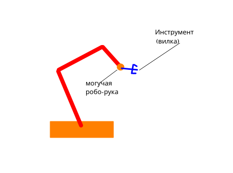
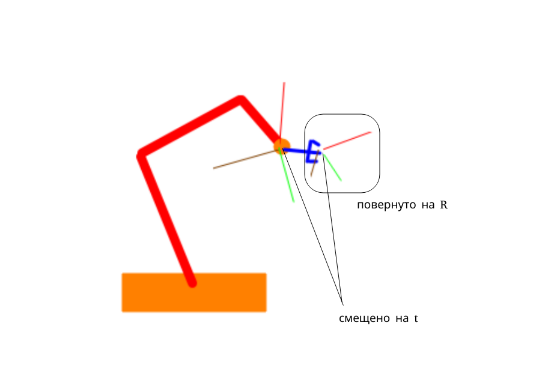
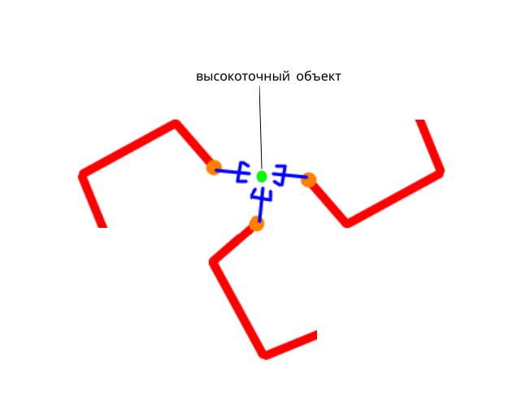
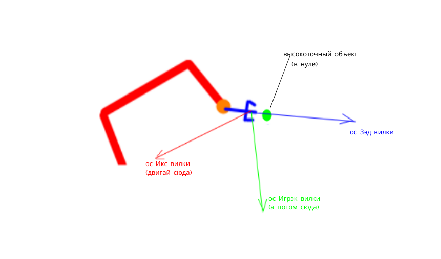
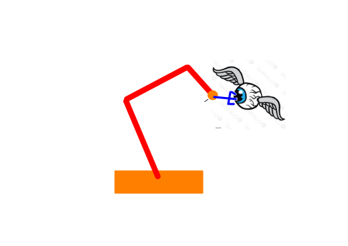

# Калибровка робо-рук для самых маленьких

Вот есть у вас робот. Не человекоподобный, но вполне боевой.
И есть у него рука, в которую вы хотите вложить... Можете, конечно, деньги, но мы будем предполагать, что 
все-таки вкладывается в эту роботическую руку какой-то инструмент.

Рукой этой можно водить. Обычно для этого есть какой-нибудь пульт, а то еще и целое API для программирования! И чтоб водилось не абы как, робот обычно умеет ссобщать, где сейчас его рука в пространстве находится и куда и как повернута.

Чтобы инструмент на прекрасной, совершенно точно отображающей действительность, картинке выше был успешно применен роботом по назначению, необходимо знать, как робот его держит. То есть каково взаимное расположение в пространстве могучей роботической клешни и логического центра рабочей зоны нашего инструмента. Собственно, нужно то, что в мануалах называется Tool-to-Hand калибровкой.

Как ее получить? Очень просто! Но сначала немного теории.

1. Перемещение любого объекта в трехмерном пространстве можно выразить в виде комбинации вращения вокруг какой-то точки отсчета и смещения относительно нее же. 
Если объект при этом состоит из хотя бы трех точек, не лежащих на одной прямой, то такая комбинация вращений и смещения (относительно фиксированной точки) находится однозначно

2. Вращения в 3D пространстве можно задавать по-разному:

- углами Эйлера (горите в аду)
- унитарными матрицами
- единичными кватернионами
- вектором оси вращения, длиной в величину поворота
- еще чем-нибудь, являющимся обобщением еще чего-нибудь

Мы будем вращать матрицей $R$ -- так будет проще, что мы дальше и увидим

3. Ну, про то как по-разному задавать смещения мы уж обсуждать не будем. Эта заметка не настолько для самых маленьких. Просто вектор $t$.

4. Теперь если у нас есть точка в пространстве, координаты которой задаются вектором $p_0$, то перемещение ее в точку $p_1$ имеет вид:

$$p_1 = R \cdot p_0 + t$$

Всё просто.

Собственно, наша задача -- найти $R$ и $t$, переводящие руку робота в острие вилки, чтоб робот почувствовал единение с ней, и вилка стала продолжением робота.
Либо наооборот -- переводящие острие вилки в руку робота -- не важно. Это взаимно обратные преобразования.

Чтобы решить эту задачу многие производители роботов предлагают слабым и неточным человекам проделать вручную следующую манипуляцию из двух независимых этапов.

Будем считать, что начало отсчета (ноль) в рабочей зоне вилки -- прямо острие ее центрального зуба.

Берем какой-нибудь предмет, желательно маленький и острый (да просто любой, на котором можно с достаточной точностью сказать, что он в процессе измерений оказался в нуле нащего инструмента). Накрепко прикручиваем его на досигаемом расстоянии для инструмента, удерживаемого роботом. И начинаем в него тыкать вилкой.

1. Тыкаем в него под разными углами, каждый раз совмещая ноль системы координат иструмента с объектом. И запоминаем положения руки робота при каждом совмещении (робот умный, робот сам запомнит)
Фактически нам надо просто двигать робота по поверхности сферы, радиус которой задается выносом острия нашей вилки относительно робо-руки. Это первый этап.

2. Опять тыкаем, совмещая ноль.
После чего сначала двигаем робота так, чтоб объект относительно инструмента сдвинулся влево (то есть мы двигаем вилку вдоль оси $X$ ее рабочей области).
А потом то же самое, но чтоб объект поехал вниз (двигаем вилку вдоль $Y$ оси ее рабочей области). Влево и вниз это, конечно, относительно -- ну, вы поняли...
Самое главное -- руку робота нужно только смещать. Поворачивать нельзя!

И, о чудо, этого достаточно! И обе стадии можно делать в любом порядке. И умные роботы сами посчитают, как же они держат вилку!

# Как это работает?

Ну-с, понеслись формулы!

Пусть $R_r, t_r$ -- задают текущее положение руки робота относительно какой-то общероботической системы координат, в лучшем мире, в котором живет робот. Ну, то есть это текущее смещение его руки от "мирового" нуля. 
Пусть $R, t$ -- неизвестное, искомое нами преобразование вилки-в-руку
И,наконец, пусть $p_w$ -- координаты высокоточного объекта в мире робота, а $p$ -- координаты этого же самого объекта, но в мире вилки. 

Тогда
$$ p_w = R_r \cdot (R \cdot p + t) + t_r $$

1. В первом этапе мы стараемся двигать руку робота так, чтоб $p$ оставался равен 0. Пусть мы посмотрели так с $N$ разных сторон
(получили $(R_{r_1}, t_{r_1}), (R_{r_2}), t_{r_2}), ... (R_{r_N}, t_{r_N})$)

Тогда мы имеем систему уравнений

$$ p_w = R_{r_i} \cdot t + t_{r_i}, \forall i = 1..N $$

ведь $R \cdot p$ благополучно обнулился.

Ясно дело, что $p_w$ нам совершенно не интересен, так что через него можно поприравнивать правые части между каждой парой измерений и решить систему линейных уравнений

$$ (R_{r_i} - R_{r_j}) \cdot t = t_{r_j} - t_{r_i}, \forall i,j: i\ne j $$

Разумеется, тут уравнений намного больше чем неизвестных, система переопределенная, а может быть и несовместная -- ведь мы же измерения из реального мира натащили...

Для каждой пары $i,j$ почти наверное (в смысле мощность множества неблагоприятных исходов имеет меру нуль) система
$ (R_{r_i} - R_{r_j}) \cdot t = t_{r_j} - t_{r_i} $
совместна (можете доказать, вспомнив природу матриц $R$ и откуда они взялись). Но не спешите хватать любую из них и решать по отдельности -- матрица $R_{r_i} - R_{r_j}$ невероятно, чудовищно, ужасно плохо обусловлена и лобовое численное решение улетит черт знает куда.
Потому лучше решать численно все системы разом, минимизируя невязку.

В результате мы (ну, то есть робот, конечно) получим $t$ компоненту искомого преобразования.

2. С этапом вторым все тоже просто

Мы опять подъехали так, что $p = 0, t_{r_0}, R_r$.
А потом сделали движение вдоль оси $X$: 
$$p = (-\Delta x, 0, 0), t_r = t_{r_0} + \Delta t_x; R_r = const$$
И вдоль оси $Y$: 
$$p = (0, -\Delta y, 0); t_r = t_{r_0}+ \Delta t_y; R_r = const$$

Получаем

$$\begin{cases} 
p_w = R_r \cdot (R  \cdot 0 + t) + t_{r_0}, \\
p_w = R_r \cdot (R  \cdot (-\Delta x, 0, 0) + t) + t_{r_0} + \Delta t_x, \\
p_w = R_r \cdot (R  \cdot (0, -\Delta y, 0) + t) + t_{r_0} + \Delta t_y, \\
\end{cases}$$

Вычитаем первое из всех остальных

$$\begin{cases} 
0 = R_r \cdot R  \cdot (-\Delta x, 0, 0) + \Delta t_x, \\
0 = R_r \cdot R  \cdot (0, -\Delta y, 0) + \Delta t_y, \\
\end{cases}$$

Или 

$$\begin{cases} 
R_r \cdot R  \cdot (\Delta x, 0, 0) = \Delta t_x, \\
R_r \cdot R  \cdot (0, \Delta y, 0) = \Delta t_y, \\
\end{cases}$$

Матрицы вращения унитарны и имеют единичную норму, так что векторы в сдвижек в каждом уравнении имеют одинаковую длину. Нормируем!

$$\begin{cases} 
R_r \cdot R  \cdot (1, 0, 0) = \frac{\Delta t_x}{\Delta x}, \\
R_r \cdot R  \cdot (0, 1, 0) = \frac{\Delta t_y}{\Delta y}, \\
\end{cases}$$

Векторы под матрицами слева ортогональны. Векторы справа тоже должны быть ортогональны. Эх, нам бы третьего... Да запросто! Берем третий вектор как векторное произведение и радуемся (ну, конечно, убедитесь, что у вилки и у робота системы координат одинаковосторонние (право или лево), иначе ось придется обратить)

$$\begin{cases} 
R_r \cdot R  \cdot (1, 0, 0) = \frac{\Delta t_x}{\Delta x}, \\
R_r \cdot R  \cdot (0, 1, 0) = \frac{\Delta t_y}{\Delta y}, \\
R_r \cdot R  \cdot (0, 0, 1) = \frac{\Delta t_x}{\Delta x} \times \frac{\Delta t_y}{\Delta y}, \\
\end{cases}$$

Как дальше решается эта прекрасная матричная система, наверное, совершенно понятно. Ведь $R_r$ обратима!

Теперь у нас есть и $R$ компонента.

Готовенько! Робот может приступать к работе инструментом!

P.S. Поскольку данные манипуляции должны проводиться человеком, на глазок проверяющим, попал ли робот вилкой или нет, точность такой калибровки очень плоха. Для высокоточных манипуляций нужно проводить автоматическую калибровку, используя более высокоточный инструмент измерения чем человеческий глаз.